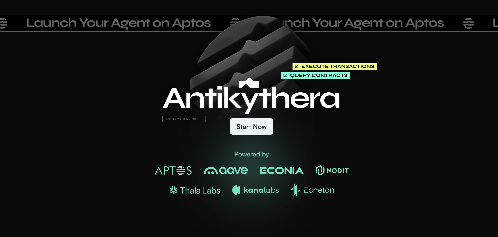
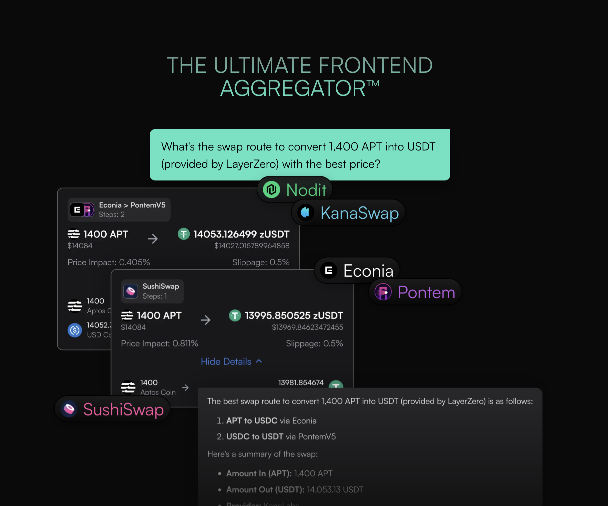

# Antikythera

## TLDR

WIP

- Antikythera is a AI agent with Function Calling which integrates accurate, real-time onchain data from various DApps

- Aptos hosts numerous dApps. Our AI bot will identify the best prices, arbitrage opportunities, yield opportunities, and current swap routes. It can even execute actions on behalf of users.

## Agents

- We're witnessing the rise of automated agents. Examples like Langchain + AgentGPT and Claude Engineer demonstrate how AI can make autonomous decisions. Large Language Models (LLMs) require integration with external data and execution environments, known as "Tools". For this hackathon, we've created a Proof of Concept (PoC) by developing tools for key Aptos dApps.
- Our goal is to open these tools as a public good, allowing anyone to create agents on or off our platform. For instance, if a user asks the AI to purchase an Aptos Name, it will check the balance, swap APT if needed, verify the name price, and complete the registry process automatically.
- In the future, we plan to leverage Move's ability to extract Package ABI through specific RPC methods. This will allow AI to evaluate and utilize new packages on-the-fly by analyzing the Aptos Move Code. We've already implemented this approach with ThalaSwap, inspired by Thala's API SDK.

## Querying the blockchain

- Integration with DeFiLlama for chain TVL and protocol/yield oppertunity data on Aptos
- Token information using Hippo Labs & Nodit-corrected data, including bridged tokens and their diversification benefits
- Token portfolio of a address
- ThalaSwap pool information
- EchelonMarkets pool yields
- Kana Labs DEX aggregator integration for optimal pricing and routes

## Future Work

- On-demand Tool addition capabilities
- We aspire to create a universal client/frontend similar to Instadapp or DeFiLlama by combining AI agents with wallet connections. Our goal is to develop a decentralized frontend aggregator, providing a more user-friendly experience for newcomers to the ecosystem.
